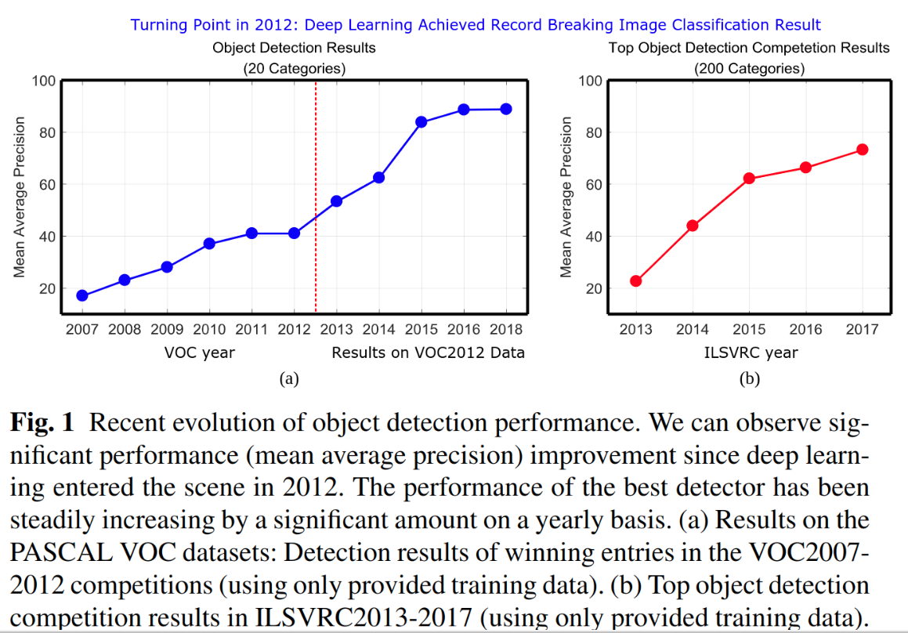

## 深度学习在目标检测的研究综述

## Contents

[TOC]

##　简介

如图所示，目标检测性能显著提升是在2012年，此时深度学习兴起，最佳的detector性能自此逐年提高。

目标检测可以分为两种类型：
- 具体实例检测
- 具体种类检测

第一种类型针对特定目标(例如三胖的脸，五角大楼，或者我的狗汤姆)的实例进行检测
第二中类型的目标则是去检测预定义好类型的不同实例（如人类，猫，自行车，狗）

通用对象检测问题定于为：给定任意一张图像，确定是否存在预定义类别中语义对象的任何实例，如果存在，则返回空间位置和范围。

上图所示关于通用目标检测的识别问题分类

## 问题背景

主要的挑战，通用对象检测旨在定位和识别各种自然对象类别。
理想的通用目标检测起需要实现两个竞争目标：高质量/准确度和高性能。
高质量要求必须准确地定位和识别图像或者视频帧中的目标，以至于大千世界中的各种各样的目标类型能区分开（即 high distinctiveness）。并且来自相同类型的目标实例，遭受了类别内的外观变化（比如各式各样造型各异的椅子）也能识别和定位(即high robustness)。
高效率需要以足够高的帧率完成完整的任务同时，使用可接受范围的内存和存储空间。
尽管过去数十年的研究和显著进步，高质量和高效率的结合还是没有满足。

##　框架

自深度学习进入目标检测领域的一些里程碑式的框架，如下图。过去几年，几乎所有提出的矿建都是基于这些里程碑框架上做某方便的改进得到。概括地说，这些detetor能分为两大类：

- 两阶段检测框架：它包含一个区域提案（region proposal）的预处理过程，使得整个检测分为两个极端。
- 单截断检测矿建或者无区域提案检测矿建。
  

### RCNN

RCNN基本步骤：
1.候选区域生成：一张图生成1k~2k个候选区域（采用Selective Search方法）
2.特征提取:　对每个候选区域，使用深度卷积网络提取特征(CNN)
3.类别判断：特征送入每一类的SVM分类器，判别是否属于该类
4.位置精修：使用回归器精细修正候选框的位置。

尽管实现了高精度的检测，RCNN显著的缺陷：

- 训练阶段多，复杂，慢。而且由于每个截断必须分开训练很难优化。
- 需要从外部检测仅提供粗糙的候选区域
- 由于CNN特征是从每张图片每个候选区域单独提取出来的，使得SVM和bounding box regression的训练是非常消耗空间和时间。
- 同样，由于CNN特征是从每个测试图片的目标区域提取出来的，测试是很慢的
  
### SPPNet
在测试阶段CNＮ特征的提取是制约RCCN检测的主要瓶颈，因为它需要从一张图中数以千计的候选区域中提取CNN的特征。He等人注意到这个问题，酒吧传统的空间金字塔池化加入了CNN架构，去获取固定尺寸的feature map。SPPNet的引入，显著加速了RCNN且没有牺牲任何检测质量。然后SPPnet显著加速了RCNN的评估，却没有带来客观的训练加速。此外，SPPnet中的微调无法在SPP层之前更新卷积层，这限制了非常深层网络的准确性。

### Fast RCNN

FastRCNN提高了检测速度和质量。FastRCNN使能了end-to-end的检测器训练（忽略掉了候选区域生成的过程）。它使用multitask loss同时学习softmax分类器和class-specific bounding box regression.而不是像RCNN/SPPNet那样分别训练softmax classifier,SVM,BBR。Faste RCNN采用了跨候选区域的卷积计算，并且在最后一个卷积层和第一个全连接层之间添加了一个感兴趣区域池化层（RoI,Region of Interest）去对每个候选区域（实质上就是RoI）提取固定长度的特征。本质上，RoI池化是使用特征级别的扭曲（warping）去近似图像级别的扭曲。ROI池化层之后的特征是馈入到全连接层序列，最终进入两个sibling输出层：对目标类型的预测的softmax probabilities和class-specific bounding box regression offset去优化后proposal.
与RCNN和SPPNet相比，FastRCNN显著提高了效率--训练快3倍，测试快10倍。
总结：Fast RCNN具有吸引人的优势，具有更高的检测质量，单阶段训练过程可更新所有网络层，并且无需存储特征缓存
### Faster RCNN

虽然Fast RCNN 显著加速了检测过程，但它仍然依赖于外部候选区域。 候选区域的计算是Fast RCNN的瓶颈。
在当时发现，CNN在卷积层有杰出的定位目标的能力，这个能力在全连接层是虚弱的。因此selective search能使用CNN去替代产生候选区域。Faster RCNN框架提出了一个高效且准确的候选区域网络（RPN,Region Proposal Net）.在Faster RCNN中，RPN和Fast RCNN共享大量卷积层。来自共享卷积层最后的特征被用于两个分支，候选区域提出和区域分割。

> RPN首先在每个卷积特征图位置上初始化k个n*n的不同尺度和比例的参考boxes(即 我们anchor)，每个n*n的anchor映射到一个低维向量（例如256维的ZF，和512维的VGG）,然后馈入两个sibling全连接层--一个是目标类型分类另一个box回归。 与Fast RCNN不同，在RPN中用于回归的特征具有相同的尺寸。 
> RPN，实际上，是一种全卷积网络，Faster RCNN因此是一种没有使用手工特征的基于纯CNN的框架

## RFCN (Region based Fully Convolutional NetWorks)

RFCN仅在RoI子网中与Faster RCNN不同

## Mask RCNN

## Light Head RCNN

