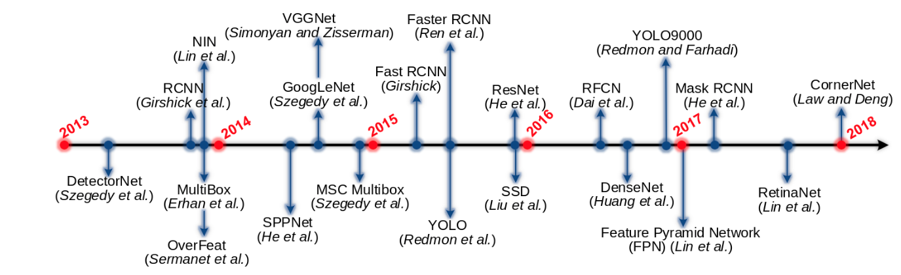

## 深度学习在目标检测的研究综述

## Contents

[TOC]

##　简介

如图所示，目标检测性能显著提升是在2012年，此时深度学习兴起，最佳的detector性能自此逐年提高。

目标检测可以分为两种类型：
- 具体实例检测
- 具体种类检测

第一种类型针对特定目标(例如三胖的脸，五角大楼，或者我的狗汤姆)的实例进行检测
第二中类型的目标则是去检测预定义好类型的不同实例（如人类，猫，自行车，狗）

通用对象检测问题定于为：给定任意一张图像，确定是否存在预定义类别中语义对象的任何实例，如果存在，则返回空间位置和范围。

上图所示关于通用目标检测的识别问题分类

## 问题背景

主要的挑战，通用对象检测旨在定位和识别各种自然对象类别。
理想的通用目标检测起需要实现两个竞争目标：高质量/准确度和高性能。
高质量要求必须准确地定位和识别图像或者视频帧中的目标，以至于大千世界中的各种各样的目标类型能区分开（即 high distinctiveness）。并且来自相同类型的目标实例，遭受了类别内的外观变化（比如各式各样造型各异的椅子）也能识别和定位(即high robustness)。
高效率需要以足够高的帧率完成完整的任务同时，使用可接受范围的内存和存储空间。
尽管过去数十年的研究和显著进步，高质量和高效率的结合还是没有满足。

## 数据集和性能评价指标

对于通用目标检测，有四个著名的数据集：

PASCAL  VOC ,  ImageNet  ,  MS  COCO ，Open Images

- 评价指标
  
  三个评价检测算法性能指标：
  1. 检测速度 FPS
  2. 检测精度
  3. 召回率

通常使用平均精度（AP,Average Precision）度量，AP用于评价某一特定目标的检测性能。
为了评价所有种类的检测性能，一般采用mAP(mean Average presision)
检测器检测的标准输出为：$\{(b_j,c_j,p_j)\}_j$，j是指代目标j，b_j是指Bounding Box，c_j是类别，p_j是置信度。
如果（b，c,p）满足以下条件，则认为其是True Position(TP)：
1. 预测的类别c等于ground truth c_g
2. 交并比（IOU,Intersection Over Union）
   $$IOU(b,b^g)=\frac{area(b\bigcap b^g}{area(b\bigcup b^g)}$$，
   IOU>阈值。一般阈值为0.5

##　框架

自深度学习进入目标检测领域的一些里程碑式的框架，如下图。过去几年，几乎所有提出的矿建都是基于这些里程碑框架上做某方便的改进得到。概括地说，这些detetor能分为两大类：

- 两阶段检测框架：它包含一个区域提案（region proposal）的预处理过程，使得整个检测分为两个极端。
- 单截断检测矿建或者无区域提案检测矿建。
  

### Two Stage Framworks
#### RCNN

RCNN基本步骤：
1.候选区域生成：一张图生成1k~2k个候选区域（采用Selective Search方法）
2.特征提取:　对每个候选区域，使用深度卷积网络提取特征(CNN)
3.类别判断：特征送入每一类的SVM分类器，判别是否属于该类
4.位置精修：使用回归器精细修正候选框的位置。

尽管实现了高精度的检测，RCNN显著的缺陷：

- 训练阶段多，复杂，慢。而且由于每个截断必须分开训练很难优化。
- 需要从外部检测仅提供粗糙的候选区域
- 由于CNN特征是从每张图片每个候选区域单独提取出来的，使得SVM和bounding box regression的训练是非常消耗空间和时间。
- 同样，由于CNN特征是从每个测试图片的目标区域提取出来的，测试是很慢的
  
#### SPPNet
在测试阶段CNＮ特征的提取是制约RCCN检测的主要瓶颈，因为它需要从一张图中数以千计的候选区域中提取CNN的特征。He等人注意到这个问题，酒吧传统的空间金字塔池化加入了CNN架构，去获取固定尺寸的feature map。SPPNet的引入，显著加速了RCNN且没有牺牲任何检测质量。然后SPPnet显著加速了RCNN的评估，却没有带来客观的训练加速。此外，SPPnet中的微调无法在SPP层之前更新卷积层，这限制了非常深层网络的准确性。

#### Fast RCNN

FastRCNN提高了检测速度和质量。FastRCNN使能了end-to-end的检测器训练（忽略掉了候选区域生成的过程）。它使用multitask loss同时学习softmax分类器和class-specific bounding box regression.而不是像RCNN/SPPNet那样分别训练softmax classifier,SVM,BBR。见Fig13. Fast RCNN采用了跨候选区域的卷积计算，并且在最后一个卷积层和第一个全连接层之间添加了一个感兴趣区域池化层（RoI,Region of Interest）去对每个候选区域（实质上就是RoI）提取固定长度的特征。本质上，RoI池化是使用特征级别的扭曲（warping）去近似图像级别的扭曲。ROI池化层之后的特征是馈入到全连接层序列，最终进入两个sibling输出层：对目标类型的预测的softmax probabilities和class-specific bounding box regression offset去优化后proposal.
与RCNN和SPPNet相比，FastRCNN显著提高了效率--训练快3倍，测试快10倍。
总结：Fast RCNN具有吸引人的优势，具有更高的检测质量，单阶段训练过程可更新所有网络层，并且无需存储特征缓存
#### Faster RCNN

虽然Fast RCNN 显著加速了检测过程，但它仍然依赖于外部候选区域。 候选区域的计算是Fast RCNN的瓶颈。
在当时发现，CNN在卷积层有杰出的定位目标的能力，这个能力在全连接层是虚弱的。因此selective search能使用CNN去替代产生候选区域。Faster RCNN框架提出了一个高效且准确的候选区域网络（RPN,Region Proposal Net）,见Fig13.在Faster RCNN中，RPN和Fast RCNN共享大量卷积层。来自共享卷积层最后的特征被用于两个分支，候选区域提出和区域分割。

> RPN首先在每个卷积特征图位置上初始化k个n*n的不同尺度和比例的参考boxes(即 我们anchor)，每个n*n的anchor映射到一个低维向量（例如256维的ZF，和512维的VGG）,然后馈入两个sibling全连接层--一个是目标类型分类另一个box回归。 与Fast RCNN不同，在RPN中用于回归的特征具有相同的尺寸。 
> RPN，实际上，是一种全卷积网络，Faster RCNN因此是一种没有使用手工特征的基于纯CNN的框架

#### RFCN (Region based Fully Convolutional NetWorks)

虽然Faster RCNN比Fast RCNN快一个数量级，但是区域子网仍然需要按每个RoI应用（每个图像数百个RoI）。因此Dai等人提出RFCN检测器，它是一个完全的卷积（没有隐含的全连接层），几乎所有的计算都在整张图像上共享。如图13所示，RFCN与Faster RCNN唯一的不同在于ROI子网，在Faster RCNN中，ROI池化层之后的计算不能共享，因此，Dai等人提出全部使用卷积层去构造一个共享的ROI子网，在预测之前，提取最后一层卷积特征的RoI crops。然鹅，他们发现这种简单的设计检测准确率相当低，推测到更深的卷积层对类别的语义更敏感，而对平移不够敏感，然而目标检测需要与平移变化相关的定位表示。基于这个观察，代等人通过使用一组专门的卷积层作为FCN的输出构建了一组位置敏感的得分图，在上面添加了与标准RoI池化层不同的位置敏感的RoI池化层。

#### Mask RCNN

He 等人遵循概念简单、效率和灵活性的精神，提出了Mask RCNN，通过扩展更快的RCNN来处理像素级的目标实例分割。Mask RCNN采用相同的两级管道，相同的一级(RPN)。在第二阶段，在预测类和框偏移量的同时，Mask RCNN添加了一个分支，为每个RoI输出一个二进制掩码。新的分支是一个完全卷积网络(FCN)，位于CNN专题地图之上。为了避免原始RoI池层(RoIPool)造成的错位，提出了一个RoIAlign层来保持像素级空间对应。Mask RCNN采用骨干网络ResNeXt101-FPN，实现了COCO目标实例分割和边界盒目标检测的顶级结果。它很容易训练，概括得很好，并且只给更快的RCNN增加了很小的开销，运行速度为5 FPS

#### Chained Cascade Network and Cascade RCNN
级联的本质是通过使用多级分类器来学习更多的判别式分类器，以便早期阶段丢弃大量的简单否定样本，以便后期阶段可以专注于处理更困难的示例。可以将两级对象检测视为级联，第一级检测器除去大量背景，第二级对其余区域进行分类。

#### Light Head RCNN

为了更进一步加速RFCN，旷视的黎泽明等人提出Light Head RCNN，使检测网络的头部尽可能轻，以减少RoI区域计算

### One Stage Frameworks

统一流水线是指直接从全图上预测类概率和边界框偏移的架构，不涉及候选区域生成或后分类。该方法简单而优雅，因为它完全消除了候选区域生成和后续的像素或特征重采样阶段，将所有计算封装在单个网络中。因为是单个网络，所以能直接端到端的优化。

#### DetectorNet
DetectorNet设计的目标检测是一个目标包围盒掩码的回归问题。他们使用AlexNet，用回归层代替最终的softmax分类器层。给定一个图像窗口，他们使用一个网络来预测粗网格上的前景像素，以及四个额外的网络来预测目标的上、下、左、右半边。然后分组进程将预测掩码转换为检测到的边框。每个目标类型和掩码类型都需要训练一个网络。它不会扩展到多个类。DetectorNet必须获取图像的许多作物，并为每个作物的每个部分运行多个网络。

#### OverFeat

一种基于完全卷积深度网络的现代单级目标检测器。它是最成功的目标检测框架之一，赢得了ILSVRC2013本地化竞赛.OverFeat通过CNN网络的单个前向传播以多尺度滑动窗口的方式执行目标检测，该CNN网络仅由卷积层组成（除最终分类/回归层）。通过这种方式，它们很自然的共享了重叠区域的计算。OverFeat生成一个特征向量网格，每个特征向量代表输入图像中稍微不同的上下文视角位置，因此可以预测目标的存在。一旦识别出目标，则使用相同的特征来预测单个边界框回归。速度优势源于使用完全卷积网络共享重叠窗口之间的卷积计算。

#### YOLO

Redmon等人提出的YOLO是统一的框架，将目标检测问题转化为回归问题。如图13所示.由于候选区域生成阶段完全取消，YOLO直接使用一小部分候选区域预测探测。与基于区域的方法(如Faster RCNN)不同，YOLO使用全局图像的特征来预测检测结果.特别是，YOLO将图像划分为S - S网格。每个网格预测C类概率、B包围框位置和这些框的信任得分。这些预测被编码为一个S (5B +C)张量。通过完全抛弃区域提案生成步骤，YOLO的设计速度很快，实时运行45 FPS，快速版本，即快速YOLO，运行155 FPS。因为预测时YOLO看到的是整张图，它隐含地编码关于目标类的上下文信息，因此不太可能把背景预测为正例。YOLO有可能对小目标预测失败，是因为网格划分比较粗糙，并且每个网格内只能包含一个目标。

#### YOLOv2 and YOLO9000

YOLOv2的改进点有，用改良的DarkNet19替换自定义的GoogLeNet，利用了当时一系列策略，比如加上BN，去掉全连接层，使用kmeans学习到的anchor box，以及多尺度训练。

YOLO9000能实时检测超过9000个目标的类别，提出了一种联合优化方法，利用WordTree在ImageNet和COCO上同步训练，将来自多个数据源的数据组合起来。

#### SSD (Single Shot Detector)

其速度快于YOLO,准确率和Faster RCNN差不多。SSD结合了Faster RCNN中的RPN，YOLO以及多尺度卷积特征的思想。跟YOLO一样，SSD预测了固定数量的边界框和这些框中存在目标类实例的得分，然后是NMS步骤，以生成最终检测。

SSD的网络是完全卷积的，早期层基于标准架构，如VGG。然后在其之后添加几个尺寸逐渐减小的辅助CONV层。低分辨率的最后一层的信息可能空间上太粗糙而不能精确定位，SSD使用高分辨率的浅层来预测小目标。

对于不同大小的目标，SSD通过多个卷积特征图的来执行多尺度检测，每个特征图预测类别分数及边界框合适的偏移。

#### CornerNet

Law等人质疑了anchor box在SoA目标检测框架中所承担的角色。他认为anchor box的使用，特别是在单阶段检测中，存在缺陷，如造成正样本和负样本之间的巨大不平衡，降低了训练速度并引入了额外的超参数。
Law提出将边界框对象的检测公式化为检测左上角和右下角关键点对。在Cornet Net，骨干网由两个堆叠的沙漏网络组成，采用简单的拐角池方法来更好地定位拐角。在MS COCO中，corner net达到了42.1%的AP,超越了之前所有的单阶段检测器，然后在Titan X GPU平均推理效率大约4 FPS，显著低于SSD和YOLO.
CornerNet会生成错误的边界框，因为要确定应将哪些关键点对分组到同一对象中是一项挑战。
为了进一步完善Cornernet，Duanet等人提议CenterNet通过在提案中心引入一个额外的关键点来将每个对象作为关键点的三元组来检测，将MS COCO AP提升到47：0％，但推理速度比CornerNet慢。

## 目标表示

上一节中综述的主要框架(RCNN， Fast RCNN ， Faster RCNN ， YOLO ， SSD)一直在提高检测的准确性和速度。人们普遍认为CNN的表现起着至关重要的作用，而CNN架构是探测器的引擎。因此，最近在检测精度方面的大多数改进都是通过研究新网络的发展来实现的。因此我们首先回顾流行CNN架构中使用通用目标检测,其次是审查表示努力致力于改善目标的特性,如发展不变的特性来适应几何目标规模的变化,姿势,观点,一部分变形和执行多尺度分析,提高目标检测在一个广泛的鳞片。

### 流行的CNN架构

架构演进的趋势是网络越来越深.见下表

### Methods For Improving Object Representation

物体在图像中的尺寸是未知的，图片中的不同物体尺寸也可能是不同的，而DCNN越深层的感受野越大，因此只在某一层上进行预测显然是难以达到最优的，一个自然的想法是利用不同层提取到的信息进行预测，称之为multiscale object detection，可分成3类：

    1 使用多个CNN层的组合特征进行检测

    2 在多个CNN层上直接检测

    3 结合上述两种方法

- 使用多个CNN层的组合特征进行检测
代表方法有Hypercolumns，HyperNet，ION。这种特征组合通常通过跳跃连接来完成.
利用CNN多个层的联合特征进行检测，是在进行预测之前，从多个层结合特征。具有代表性的方法包括Hypercolumns、HyperNet和ION。这种特性的组合通常是通过跳跃连接来完成的，这是一种经典的神经网络思想，它跳过网络中的某些层，将较早层的输出作为后一层的输入，这种体系结构最近在语义分割方面变得流行。如图所示，ION使用跳跃池从多层中提取RoI特征，然后利用组合特征对选择性搜索和边框生成的目标提案进行分类。HyperNet,如图所示，采用类似的思路，融合深、中、浅层特征，通过端到端联合训练策略生成目标方案并预测目标。这种方法只提取每幅图像中的100个候选区域。组合特性更具有描述性，更有利于定位和分类，但增加了计算复杂度。

- 在多个CNN层上直接检测

FCN通过平均分割概率结合多个层的从粗糙到精细的预测。SSD，MSCNN，RBFNet，DSOD结合多个特征图的预测来处理各种大小的目标。SSD将不同比例的默认框展开到CNN中的多个层，并强制每个层专注于预测特定比例的目标

- 结合上述两种方法

从具有较大感受野的后面的层检测大目标，从具有较小感受野的前面的层检测小目标，感觉是很自然的，然而，简单地检测来自前面层的目标可能导致效果很差，因为前面的层具有较少的语义信息。因此，为了结合两者的优点，最近的一些工作提出了在多个层上检测目标，并通过组合来自不同层的特征去获取每个检测层的特征。代表方法有SharpMask，DSSD(Deconvolutional Single Shot Detector)，FPN(Feature Pyramid Network)，TDM(Top Down Modulation)，RON(Reverse connection with Objectness prior Network)，ZIP，STDN(Scale Transfer Detection Network)，RefineDet，StairNet，如表7和图11，图12所示。

如下图所示，这些方法都有高度相似的检测架构，具体来讲，在自下而上的传递之后，最终的高级语义特征由自上而下的网络回传，以便在横向处理后与来自中间层的自下而上的特征相结合

### 其他类内变化的处理

强大的对象表示应结合独特性和鲁棒性。上一节介绍了大量工作在处理不同尺度的目标上所做的工作。但是目标检测对于真实世界的变化，仍然需要不仅在尺度上鲁棒，在以下三个方面也需要鲁棒：

- 几何变换
- 遮挡
- 图像质量下降

处理这类问题，最直接的办法就是扩大数据集。例如对于旋转的鲁棒性，可以通过添加目标在旋转在许多方向的训练集。鲁棒性能通过大量的学习提高，但是，通常会带来高昂的训练代价和复杂的模型参数。因此，研究者们提出了针对这个问题的方法：

#### 几何变换处理

DCNN对明显的几何变换有着天生的限制。局部最大池化层的引入已使DCNN可以享受一些平移不变性，但是中间特征图实际上对于输入数据的大型几何变换并没有不变，一些方法用于增强CNN表示的鲁棒性，如STN。
尽管旋转不变性在某些应用中可能很有吸引力，例如场景文本检测，面部检测和航拍图像，但针对旋转的通用对象检测工作却有限，因为流行的基准检测数据集（例如PASCAL VOC，ImageNet，COCO）实际上并未显示旋转图像。
在深度学习之前，对于目标检测，DPMs(Deformable Part based Models)是非常成功的（10年的文章，引用有7000多次），它是用可变形配置，通过排列部分组件来表示目标。这种DPM建模方式对目标姿态，视角和非刚性变形的变换不太敏感，是因为目标的部分相应地定位，并且它们的局部外观是稳定的。所以现在一些深度学习的方法也借鉴DPM的思路。

#### 遮挡处理

在真实世界的图像中，遮挡很常见，导致对象实例丢失信息。 可变形部分的构想可用于遮挡处理，因此提出了可变形RoI池化和可变形卷积以通过为通常固定的几何结构提供更大的灵活性来减轻遮挡。
尽管做出了这些努力，但是遮挡问题仍未解决。将GAN应用于此问题可能是一个有前途的研究方向

#### 图像质量下降的处理

在现实世界中，图像噪声是一个常见问题。它通常由曝光不充分，低质量相机，图像压缩或者其他边缘设备或者可穿戴设备本身所使用的低成本传感器导致的。虽然低画质可能会降低视觉识别性能，但大多数当前方法都是在无降级和清洁的环境中进行评估的。事实证明，PASCAL VOC，ImageNet，MS COCO和Open Images都专注于相对高质量的图像。到目前为止，解决此问题的工作非常有限。

## 上下文建模

在物理世界中，视觉目标出现在特定的环境中，并且通常与其他目标一起出现，这是有充分的心理学证据的，语境在人类识别系统中起着重要作用。

上下文大致分为三种类型：

1 语义上下文：在某些场景中找到目标但在其他场景中找不到目标的可能性

2 空间上下文：在某个位置找到一个目标的可能性

3 尺度上下文：目标相对于场景中的其他目标，其尺寸大小是有限的。

当前SOTA的方法（Faster RCNN，FCN）并没有显式利用上下文信息，而更多的是隐式的使用，因为它们学习了多级抽象的的层次表示。
Global context
考虑图像或场景级别的上下文，可以用作目标检测的线索（例如，卧室将预测有床的存在）

Local context
考虑目标关系中的局部环境，目标与其周围区域之间的相互作用。

## 候选检测方法

在图像中，目标以任何尺度位于任何位置。在手工特征描述器（SIFT,HOG,LBP）的全盛时期，对于目标检测最成功（DPM）的方法使用滑动窗口技术。然而，窗口的数量巨大，并且随着图像中像素的数量而增长，并且需要以多种比例和纵横比进行搜索进一步增加了搜索空间。 因此，应用复杂的分类器在计算上过于昂贵。
在2011年左右，研究人员提出了利用object proposal来缓解计算可操作性和高检测质量之间的紧张关系object proposal源于objecteness这个概念，object proposal是图像中可能包含目标的一组候选区域。object proposal通常作为预处理步骤，以通过限制需要由检测器评估的区域数量来降低计算复杂度。因此，一个好的检测方案应该具有以下特征:
1. 高召回，只需提出几个建议即可实现;
2. 建议尽可能准确地匹配目标;
3. 高效率

在基于传统低级线索（如颜色，纹理，边缘和梯度）的候选目标方法中，Selective Search，MCG和EdgeBoxes更为流行。后来就成瓶颈了。最近的基于DCNN的候选目标方法可以分为两类：基于边界框的和基于对象分割的。
最近基于DCNN的目标提议方法一般分为两类:基于边框的和基于目标段的，有代表性的方法如下表所示

- **Bounding Box Proposal Methods**

RPN通过在最后一个共享CONV层的特征图上滑动一个小型网络来预测object proposal。在每个滑动窗口位置，通过使用k个anchor box预测k个proposal.每个anchor位于图像上某个位置的中间，anchor与特定的比例和纵横比相关联.

Renet等人提出通过共享它们的卷积层将RPN和Fast RCNN集成到单个网络中，从而导致了Faster RCNN，这是第一个端到端检测管道。RPN已被许多最先进的目标探测器广泛选择为提案方法

- **Object Segment Proposal Methods**
  
分割候选比边界框候选富含更多信息，而且朝着对象实例分割更进一步。

DeepMask是其中的先驱，后续有更高级的SharpMask。

## 其他问题

### 数据增强
增强是指通过使基础类别保持不变的转换(如裁剪、翻转、旋转、缩放和翻译)来扰乱图像，以生成类的其他样本
图像分辨率对检测准确率有明显的影响。因此，在图像增强技术中，缩放被广泛使用，因为高分辨率的输入有助于小目标的检测。

### 新颖的训练策略

在各种尺度变化下检测物体，尤其是对非常小的物体的检测，是一个主要的挑战。
已经显示，图像分辨率对检测精度有相当大的影响，因此缩放比例在数据增强中特别常用，因为更高的分辨率会增加检测小物体的可能性。
SNIP分别在较小和较大规模上引入了一种新颖的训练方案，该方案可以减少训练过程中的尺度变化，但不减少训练样本。
SNIPER允许进行有效的多尺度训练，仅以适当的比例处理地面真实对象周围的上下文区域，而不是处理整个图像金字塔

###  Reducing Localization Error.
在对象检测中，检测到的边界框与其地面真值框之间的“交集相交”（IOU）是最受欢迎的评估指标，并且需要IOU阈值（典型值为0：5）来定义position和negative。 从图13可以看出，在大多数现有技术的检测器中，对象检测被公式化为一个多任务学习问题，即联合优化softmax分类器，该分类器为对象建议分配类标签和边界 boxregressors，通过最大化IOU或检测结果与地面真实性之间的其他度量来定位对象。 边界框只是对关节对象的粗略近似，因此边界框几乎总是包含背景像素，这会影响分类和定位的准确性.

#### Class Imbalance Handling：
与图像分类不同，对象检测还有另一个独特的问题：带标签的对象实例的数量与背景实例（图像区域不属于任何感兴趣的对象类别）的数量之间存在严重的不平衡。大多数背景示例都是容易产生的消极情绪，但是这种失衡会使训练效率非常低下，并且大量容易产生的消极情绪往往会使训练不堪重负.
由于区域提议阶段会快速滤除大多数背景区域并提出少量对象候选对象，因此在两阶段检测器中，此类类别不平衡问题得到了一定程度的缓解.
在一级对象检测器的情况下，这种不平衡非常严重（例如，每个对象有100,000个背景实例）. Linet提出了焦点损失（Focal Loss），以通过校正CrossEntropy损失来解决此问题，从而降低权重分配给正确分类示例的损失。 Liet从梯度范数分布的角度研究了这一问题，并提出了一种梯度协调机制（GHM）来解决这个问题。

## 总结

还有许多工作要做，重点可以考虑以下八个领域：

（1）开放世界的学习

目前的检测算法学习的数据是相当有限的，与人类视觉系统尚有距离。

（2）更好更有效的检测框架

（3）紧凑高效的深度CNN特征

（4）健壮的目标表示

当前对各种变化还是缺乏健壮性，因此很明显的限制了真实世界的应用。

（5）上下文推理

（6）对象实例分割

（7）弱监督或非监督学习

（8）3D目标检测