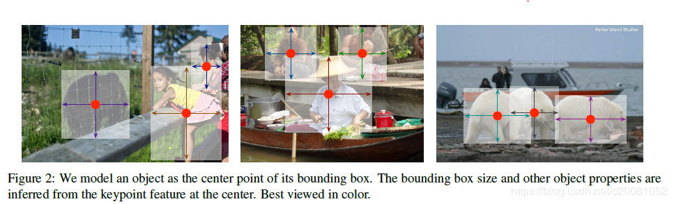

# Objects as Point

构建模型时将目标作为一个点，即目标BBOX的中心点，我们的检测器采用关键点估计来找中心店，并回归到其他目标属性，例如尺寸，3D位置，方向，甚至姿态。

One stage detectors 在图像上滑动复杂排列的可能bbox（即锚点）,然后直接对框进行分类，而不会指定框中内容。

Two-stage detectors 对每个潜在框重新计算图像特征，然后将那些特征进行分类。

后处理，即 NMS（非极大值抑制），通过计算Bbox间的IOU来删除同个目标的重复检测框。这种后处理很难区分和训练，因此现有大多检测器都不是端到端可训练的。

本文通过目标中心点来呈现目标（见下图），然后在中心点位置回归出目标的一些属性，例如：size, dimension, 3D extent, orientation, pose。 而目标检测问题变成了一个标准的关键点估计问题。我们仅仅将图像传入全卷积网络，得到一个热力图，热力图峰值点即中心点，每个特征图的峰值点位置预测了目标的宽高信息。

模型训练采用标准的监督学习，推理仅仅是单个前向传播网络，不存在NMS这类后处理。

对于3D BBox检测，我们直接回归得到目标的深度信息，3D框的尺寸，目标朝向；

对于人姿态估计，我们将关节点（2D joint）位置作为中心点的偏移量，直接在中心点位置回归出这些偏移量的值。

## 具体方法

