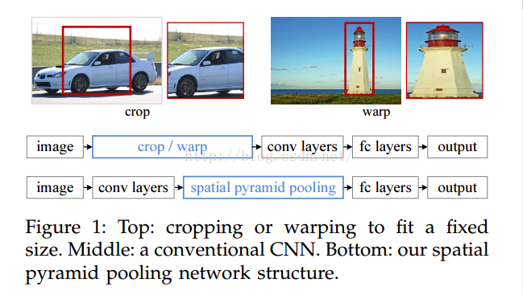
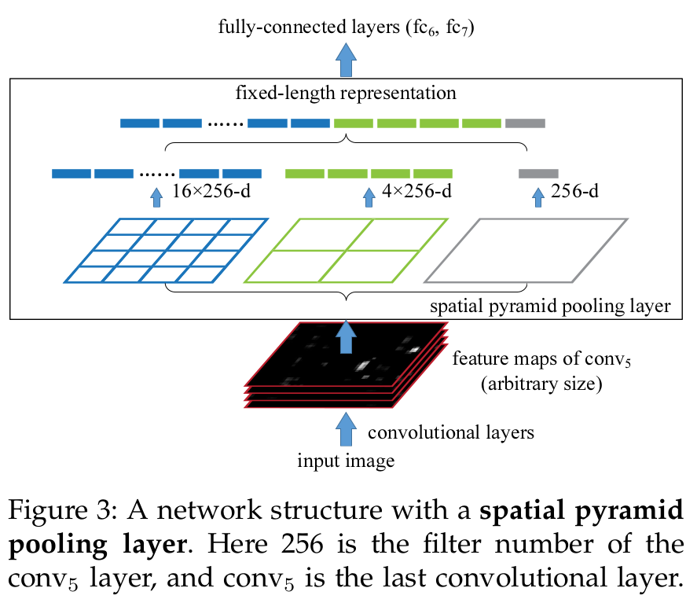
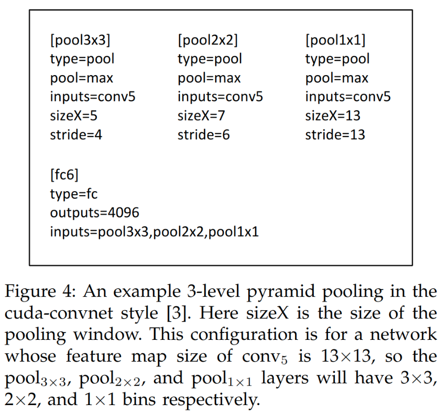

##空间金字塔池化

CNN在分类图片时，图片大小不一怎么办？

一般两种思路：

- 从图像入手，简单粗暴的是直接resize到指定大小，或者crop特定位置的图像区域，这样需要一定的额外算法或人工的辅助
- 从模型入手，比如物体检测中使用SPP-Net，取消全链接层设计。这样就可以支持任意大小输入。
  事实上，全连接层是制约输入大小的关键因素，因为卷积和池化根本不care你输入尺寸是多少，他们只管拿到前一层的feature map，然后做卷积池化输出就好了，只有全链接层，因为权重维度固定了，就不能改了，这样层层向回看，才导致了所有的尺寸都必须固定才可以。

而对于第一种思路比较粗暴，而且会在预处理环节增加很大的计算量，一般而言是没有办法的办法。
这里重点介绍第二种思路
## Content

[TOC]

##　[空间金子塔池化](../reference/Spatial_Pyramid_Pooling_in_Deep_Convolutional_Networks_for_Visual_Recognition.pdf)



### 空间金字塔特点
 - 可以解决输入图片大小不一造成的缺陷
 - 由于他把每一个feature map从不同的角度进行特征提取，再聚合的特点，显示了算法的robust性
 - 提高了object recognition精度

###　空间金字塔结构



如上图，从下往上看，这是一个传统的网络架构模型，５层卷积层，这里的卷基层是convolution和polling层的联合体。后面跟随全连接层。这里需要处理的就是在网络的全连接层前面加一层金字塔pooling层解决输入图片大小不一的情况。可以看到金字塔池化层就是把前一卷积层的feature map的进行了三个卷积操作，最后拼接到一起去保证输出的长度固定。如何保证输出长度固定，就是在执行三个卷积操作时，针对不同的尺寸的feature map每个池化操作自动调整的窗和滑移步长。调整策略：
对于大小为ａ*a的feature map。n*n表示bins的大小，其池化窗的大小$win=\lceil a/n \rceil \text{和}stride=\lfloor a/n \rfloor$　即a/n向上取整和向下取整。
例如下图，是一个三层金字塔池化的策略，其三个bins大小为$(3\times3,2\times2,1\times1)$



当输入feature map尺寸为１０＊１０时，对应三个bins的窗口和步长就为
pool 3*3：　sizeX=4 stride=3
pool 2*2：　sizeX=5 stride=5
pool 1*1：　sizeX=10 stride=10


### Code: SPP network for Pytorch

```python
import math
from collections import OrderedDict
import torch.nn as nn
import torch.nn.init as init
import torch as th
import torch.nn.functional as F
from torch.autograd import Variable


class SPPLayer(nn.Module):

    def __init__(self, num_levels, pool_type='max_pool'):
        super(SPPLayer, self).__init__()

        self.num_levels = num_levels #金字塔层数
        self.pool_type = pool_type　　#池化类型

    def forward(self, x):
        bs, c, h, w = x.size()
        pooling_layers = []
        for i in range(self.num_levels):
            kernel_size = h // (2 ** i)　　#此处说明层的bins按１，２，４，８层指数变化
            if self.pool_type == 'max_pool':
                tensor = F.max_pool2d(x, kernel_size=kernel_size,
                                      stride=kernel_size).view(bs, -1)
            else:
                tensor = F.avg_pool2d(x, kernel_size=kernel_size,
                                      stride=kernel_size).view(bs, -1)
            pooling_layers.append(tensor)
        x = th.cat(pooling_layers, dim=-1)　　##将两个张量拼接在一起
        return x

class DetectionNetSPP(nn.Module):
    """
    Expected input size is 64x64
    """

    def __init__(self, spp_level=3):
        super(DetectionNetSPP, self).__init__()
        self.spp_level = spp_level
        self.num_grids = 0
        for i in range(spp_level):
            self.num_grids += 2**(i*2)
        print(self.num_grids)
            
        self.conv_model = nn.Sequential(OrderedDict([
          ('conv1', nn.Conv2d(3, 128, 3)), 
          ('relu1', nn.ReLU()),
          ('pool1', nn.MaxPool2d(2)),
          ('conv2', nn.Conv2d(128, 128, 3)),
          ('relu2', nn.ReLU()),
          ('pool2', nn.MaxPool2d(2)),
          ('conv3', nn.Conv2d(128, 128, 3)), 
          ('relu3', nn.ReLU()),
          ('pool3', nn.MaxPool2d(2)),
          ('conv4', nn.Conv2d(128, 128, 3)),
          ('relu4', nn.ReLU())
        ]))
        
        self.spp_layer = SPPLayer(spp_level)
        
        self.linear_model = nn.Sequential(OrderedDict([
          ('fc1', nn.Linear(self.num_grids*128, 1024)),
          ('fc1_relu', nn.ReLU()),
          ('fc2', nn.Linear(1024, 2)),
        ]))

    def forward(self, x):
        x = self.conv_model(x)
        x = self.spp_layer(x)
        x = self.linear_model(x)
        return x

```